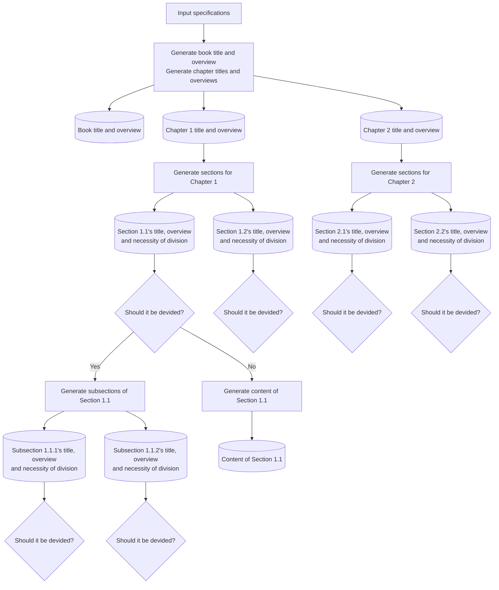

# AutoGenBook
AutoGenBook is a Python-based tool that automatically generates books using LLMs. It creates chapters, sections, and subsections recursively based on user-defined content and outputs the final book as a PDF using LaTeX.


# Changes
The following modifications have been made to AutoGenBook created by [hooked-on-mas](https://github.com/hooked-on-mas/AutoGenBook):
- LLM:
  - Modified to allow selection from Claude/Ollama in addition to OpenAI
- Execution Environment:
  - Changed from Google Colab to execution via Docker container and command line
- Content:
  - Modified to add O'REILLY-style covers
  - Increased the inclusion of sample code for programming languages
  
## How to Use

1. Clone the repository:
   ```bash
   git clone https://github.com/Tomatio13/AutoGenBook.git
   cd AutoGenBook
   ```
2. Specify the API_KEY in the .env file: You must designate exactly one PROVIDER and MODEL.

   ```bash
   cp -p env.example .env
   ```
   
   ```bash
   PROVIDER=ANTHROPIC
   MODEL=claude-3-5-sonnet-20240620
   ANTHROPIC_API_KEY=<your claude api key>

   # PROVIDER=OPENAI
   # MODEL=gpt-4o
   # OPENAI_API_KEY=<your openai api key>

   #PROVIDER=OLLAMA
   #MODEL=qwen2.5-coder:latest
   #OLLAMA_BASE_URL=http://localhost:11434/v1/
   #OLLAMA_MAX_TOKENS=256
   ```
    *Note*
    You can specify ollama, but the MODEL's max_tokens and num_ctx are small, which often results in generation failures, so it is not recommended.

3. Build the container.
   ```bash
   docker compose build  
   ```

4. Start the container.
   ```bash
   docker compose up -d 
   ```

5. Run the following command in the terminal:
   ```bash
    docker exec autogenbook-autogenbook-1 python AutoGenBook.py "Next.jsに関する教科書" "Next.js初学者" 5

    2024-10-23 01:23:11,686 - INFO - 1. 初期化しています
    2024-10-23 01:23:11,687 - INFO - 2. 本のタイトルと概要を生成を開始します
    2024-10-23 01:23:24,998 - INFO - HTTP Request: POST https://api.openai.com/v1/chat/completions "HTTP/1.1 200 OK"
    2024-10-23 01:23:25,009 - INFO - 本のタイトル：Pythonプログラミング入門
    2024-10-23 01:23:25,009 - INFO - 本の概要    ：この本は、Pythonを初めて学ぶ方から、基礎をしっかりと固めたい中級者までを対象とした教科書です。Pythonの基本的な文法から始め、データ構造、関数、モジュール、そしてオブジェクト指向プログラミングまでをカバーします。各章は実践的な例を通じて、読者が自分のペースで学習を進められるように設計されています。特に、プログラミングの初心者がつまずきやすいポイントを丁寧に解説し、理解を深めるための演習問題も豊富に用意しています。最終的には、読者がPythonを用いて簡単なプログラムを自ら作成できるようになることを目指しています。
    2024-10-23 01:23:25,612 - INFO - HTTP Request: POST https://api.openai.com/v1/chat/completions "HTTP/1.1 200 OK"
    2024-10-23 01:23:25,621 - INFO - ディレクトリ名:output/py_prog_getting_st
    2024-10-23 01:23:25,621 - INFO - 3. 章・節の内容を生成しています
    2024-10-23 01:23:34,826 - INFO - HTTP Request: POST https://api.openai.com/v1/chat/completions "HTTP/1.1 200 OK"
    2024-10-23 01:23:43,232 - INFO - HTTP Request: POST https://api.openai.com/v1/chat/completions "HTTP/1.1 200 OK"
    2024-10-23 01:23:51,013 - INFO - HTTP Request: POST https://api.openai.com/v1/chat/completions "HTTP/1.1 200 OK"
    2024-10-23 01:24:03,703 - INFO - HTTP Request: POST https://api.openai.com/v1/chat/completions "HTTP/1.1 200 OK"
    2024-10-23 01:24:10,871 - INFO - HTTP Request: POST https://api.openai.com/v1/chat/completions "HTTP/1.1 200 OK"
    2024-10-23 01:24:10,874 - INFO - 4. PDFの生成を開始します
    2024-10-23 01:24:11,934 - INFO - HTTP Request: POST https://api.openai.com/v1/chat/completions "HTTP/1.1 200 OK"
    2024-10-23 01:24:12,007 - INFO - カバー画像:/app/cover_images/d906347b-53ed-4069-bb9e-bacce2aae797.eps
    2024-10-23 01:24:12,614 - INFO - output/py_prog_getting_st/Pythonプログラミング入門.pdfの出力が完了しました
   ```

6. A PDF file is output under the output folder.
   In the example of step 5, it is output to the folder "output/py_prog_getting_st" with the file name "Introduction to Python Programming.pdf".


## AutoGenBook.py Usage

`AutoGenBook.py` is a script that assists in generating a book. This script creates a book based on the specified content, target readers, and the number of pages.

### Command Line Arguments

- `book_content` (required): Specifies information about the content of the book.
- `target_readers` (required): Defines the target readers for the book.
- `n_pages` (required): Specifies the number of pages in the book.
- `--level LEVEL` (optional): Specifies the level of mathematical usage.

### Usage Example

Below is a basic usage example of `AutoGenBook.py`:

```bash
docker exec autogenbook-autogenbook-1 python AutoGenBook.py "This is the content of the book" "young adults" 150 --level intermediate
```

### Level of Mathematical Expression Usage
1: Use almost no mathematical expressions and explain all concepts in simple language. Use expressions only when absolutely necessary, and keep them to a minimum.

2: Use mathematical expressions sparingly and focus mainly on explanations in text. Use simple expressions only when necessary.

3: Combine explanations using both mathematical expressions and text in a balanced manner. Express important concepts with mathematical formulas and supplement with text for the rest.

4: Actively use mathematical expressions to accurately express concepts and relationships. However, provide important explanations in text as well.

5: Make maximum use of mathematical expressions. Express as many concepts and relationships as possible using formulas.


## API Endpoints

The service runs at `http://localhost:8100`.

### 1. Start Book Generation

**Endpoint**: `POST /generate-book`

**Request Body**:
```json
{
    "book_content": "Description of the book's content",
    "target_readers": "Description of the target readers",
    "n_pages": 50,
    "level": 1  // Optional: frequency of mathematical expressions (1-5)
}
```

**Response**:
```json
{
    "status": "accepted",
    "message": "Book generation started",
    "task_id": "Generated task ID",
    "author": None
}
```

### 2. Check Task Status

**Endpoint**: `GET /task/{task_id}`

**Response**:
```json
{
    "status": "completed",  // "processing", "completed", "failed"
    "output_dir": "Path to the output directory",
    "title": "Title of the generated book",
    "author": "PROVIDER:MODEL_NAME"  // Example: "OPENAI:gpt-4" or "ANTHROPIC:claude-3-sonnet"
}
```

### 3. Download PDF

**Endpoint**: `GET /download/{task_id}`

Downloads the generated PDF book. This is available only if the task is completed.

### 4. Download Cover Image

**Endpoint**: `GET /download-cover/{task_id}`

Downloads the generated cover image in PNG format. This is available only if the task is completed.

### 5. Health Check

**Endpoint**: `GET /health`

**Response**:
```json
{
    "status": "healthy"
}
```

## Usage Examples

1. Request book generation:
```bash
curl -X POST "http://localhost:8100/generate-book" \
     -H "Content-Type: application/json" \
     -d '{
           "book_content": "Introduction to Python Programming",
           "target_readers": "Beginner programmers",
           "n_pages": 50,
           "level": 1
         }'
```

2. Check task status:
```bash
curl "http://localhost:8100/task/{task_id}"
```

3. Download PDF:
```bash
curl -O -J "http://localhost:8100/download/{task_id}"
```

4. Download Cover Image:
```bash
curl -O -J "http://localhost:8100/download-cover/{task_id}"
```

## API Documentation

API documentation using Swagger UI is available at:
- http://localhost:8100/docs
- http://localhost:8100/redoc

## What’s Inside AutoGenBook

While you can dive into the code for all the details, I realize that it might be a bit hard to follow, so let me explain the basic idea and workflow behind the tool.

### Overview

Since ChatGPT has limitations on how much text it can generate at once, simply asking it to “write a textbook” results in only 1-2 pages of content. To overcome this, AutoGenBook recursively breaks down the structure of a book starting from the main topic or title. It goes from chapters → sections → subsections, and so on. This approach ensures that ChatGPT can generate meaningful, self-contained book for you without hitting its output limit.

Finally, the content for each subdivided section is generated using ChatGPT, and then output as a PDF.

### Workflow

Here’s an outline of the process. I've simplified it by only showing the flow up to the creation of subsections, but the same recursive structure continues for deeper levels.



# Acknowledgements
The O'Reilly-style cover image was created based on the source code from [O-RLY-Book-GeneratorPublic](https://github.com/charleshberlin/O-RLY-Book-Generator.git).